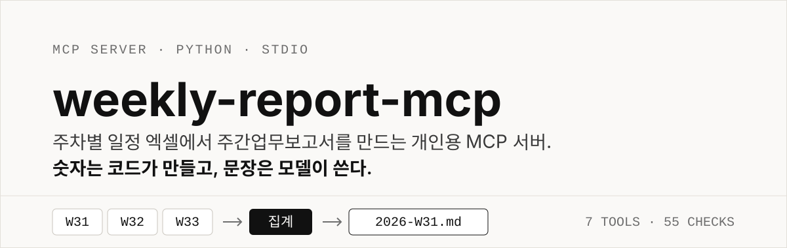
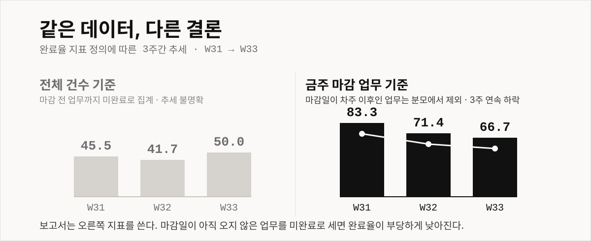
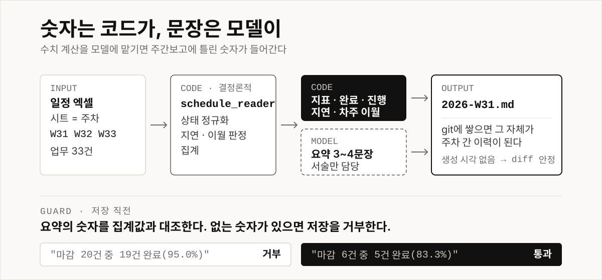

<p align="center">
  
</p>

주차별로 시트가 나뉜 일정 엑셀을 읽어 **주간업무보고서를 Markdown으로 만들어 주는 MCP 서버**입니다. Claude Code와 Codex CLI 양쪽에 붙습니다.

엑셀에서 숫자를 세는 일, 지연과 이월을 가려내는 일은 서버가 합니다. 모델은 요약 문장만 씁니다. 그래서 보고서에 틀린 숫자가 들어가지 않습니다.

```
/weekly-report W31   →   reports/2026-W31.md
```

## 실제 산출물

집계에서 자동으로 채워진 부분과 모델이 쓴 요약이 한 파일에 담깁니다. 아래는 손대지 않은 실제 출력입니다.

```markdown
# 주간업무보고 — 2026년 31주차 (07/27 ~ 08/02)

## 요약

금주 마감 6건 중 5건 완료(83.3%). 지연 2건은 리소스 부족과 담당자 휴가에
기인하며 차주로 이월된다. 보류 1건은 우선순위 재조정 대기 상태다.

## 지표

| 항목 | 값 |
|---|---|
| 금주 마감 업무 | 6건 |
| 그중 완료 | 5건 |
| **완료율** | **83.3%** |
| 전체 등록 업무 | 11건 |
| 차주 이월 | 5건 |

## 완료 (5건)

- 펌웨어 로그 파서 개선 (07/27~07/31)
- 빌드 서버 점검 (07/28~07/30)
- 사내 API 문서 정리 (07/29~08/01)
...

## 지연 / 리스크 (3건)

| 구분 | 업무 | 마감 | 사유 |
|---|---|---|---|
| 지연 | 테스트 케이스 리팩토링 | 08/10 | 리소스 부족 |
| 지연 | 빌드 실패 알림 봇 점검 | 08/03 | 담당자 휴가 |
| 보류 | 정적 분석 룰셋 업데이트 | 08/04 | 우선순위 재조정 중 |
```

지연 사유는 엑셀 비고 컬럼에서 그대로 옵니다. 모델이 원인을 추측하지 않습니다.

## 완료율을 어떻게 세는지가 결론을 바꿉니다

<p align="center">
  
</p>

마감일이 아직 오지도 않은 업무를 미완료로 세면 완료율이 부당하게 낮아집니다. W31의 `테스트 케이스 리팩토링`은 마감이 08/10인데, 7월 마지막 주 보고서에서 완료율을 끌어내릴 이유가 없습니다.

문제는 숫자가 낮게 나오는 것에 그치지 않습니다. **추세가 반대로 읽힙니다.** 전체 기준은 오르락내리락하는 노이즈지만, 금주 마감 기준은 3주 연속 하락입니다. 이쪽이 데이터의 실제 이야기입니다.

그래서 두 지표를 모두 반환하되 보고서에는 `completion_rate_due`만 씁니다.

## 어떻게 동작하는지

<p align="center">
  
</p>

역할을 이렇게 자릅니다.

| 영역 | 담당 | 하는 일 |
|---|---|---|
| 결정론적 | MCP 서버 | 엑셀 읽기, 상태 정규화, 집계, 지연·이월 판정 |
| 서술 | 모델 | 집계 결과를 근거로 요약 3~4문장 |

수치 계산을 모델에 맡기면 주간보고에 틀린 숫자가 들어갑니다. 계산은 코드가, 문장은 모델이 합니다.

### 요약도 검증합니다

요약은 자유 텍스트라 프롬프트 규칙만으로는 막을 수 없습니다. 그래서 저장 직전에 요약의 숫자를 집계값과 대조하고, 집계에 없는 숫자가 있으면 거부합니다.

```
"금주 마감 20건 중 19건 완료(95.0%)"   →  거부 (20, 19, 95 는 집계에 없음)
"금주 마감 6건 중 5건 완료(83.3%)"     →  통과
```

거부 시 사용 가능한 값의 출처를 함께 알려주므로, 모델이 숫자를 고쳐 다시 호출합니다. 직전 주 완료율과 증감폭(`83.3%`, `11.9%p`), 주차 번호, `"3주 연속"` 같은 표현은 허용 범위에 포함됩니다.

전체 건수 기준 `completion_rate`는 허용 목록에서 **의도적으로 빼두었습니다.** 요약에 그 값을 쓰는 것 자체가 보고 규칙 위반이므로 걸리는 게 맞습니다.

## 시작하기

```bash
pip install openpyxl "mcp[cli]"
```

엑셀 경로를 지정하고 바로 확인합니다.

```bash
export SCHEDULE_XLSX="/path/to/일정_샘플.xlsx"
python schedule_reader.py            # 주차별 집계 확인
python report_builder.py --all       # reports/ 에 보고서 생성
```

여기까지 되면 클라이언트에 붙입니다.

> MCP SDK 2.x 기준입니다. `FastMCP`가 `MCPServer`로 이름이 바뀌었으므로 v1 예제 코드(`from mcp.server.fastmcp import FastMCP`)는 동작하지 않습니다. v1을 쓰려면 `pip install "mcp<2"`.

### Claude Code

프로젝트 루트에 `.mcp.json`을 둡니다. **절대 경로를 쓰세요** — 클라이언트가 프로젝트 밖 작업 디렉토리에서 서버를 띄웁니다.

```json
{
  "mcpServers": {
    "weekly-report": {
      "command": "<python 절대경로>",
      "args": ["<weekly_report_server.py 절대경로>"],
      "env": {
        "SCHEDULE_XLSX": "<엑셀 절대경로>",
        "PYTHONIOENCODING": "utf-8",
        "PYTHONUTF8": "1"
      }
    }
  }
}
```

프로젝트 스코프 `.mcp.json`은 최초 1회 승인이 필요합니다. `claude mcp list`가 `Pending approval`이면 해당 디렉토리에서 `claude`를 실행해 승인하세요.

### Codex CLI

`~/.codex/config.toml`입니다. JSON이 아니라 TOML이고, 기존 설정이 있으면 **덮어쓰지 말고 추가**하세요.

```toml
[mcp_servers.weekly_report]
command = '<python 절대경로>'
args = ['<weekly_report_server.py 절대경로>']
startup_timeout_sec = 60

[mcp_servers.weekly_report.env]
SCHEDULE_XLSX = '<엑셀 절대경로>'
PYTHONIOENCODING = 'utf-8'
PYTHONUTF8 = '1'
```

TOML 키에는 하이픈 대신 밑줄(`weekly_report`)을 쓰는 게 편합니다. Windows에서는 한글 깨짐 방지로 `PYTHONUTF8`을 지정하세요.

### 슬래시 커맨드

매번 자유 프롬프트로 요청하면 주마다 보고서 형식이 달라집니다. 골격을 커맨드로 고정해 두었습니다.

```bash
# Claude Code: .claude/commands/weekly-report.md 가 저장소에 포함되어 있음
# Codex:
cp codex-prompts/weekly-report.md ~/.codex/prompts/
```

커맨드는 집계 조회 → 직전 주차 조회 → 요약 작성 → 저장 순으로 지시하고, 업무별 진행률 추정·담당자 언급·차주 계획 창작을 금지합니다. 원본 엑셀에 없는 정보이기 때문입니다.

## 입력 데이터 형식

시트 하나가 한 주차입니다. 시트명은 ISO 주차 번호(`W31`, `W32`, ...)를 씁니다.

| 업무명 | 시작일 | 마감일 | 상태 | 비고 |
|---|---|---|---|---|
| 펌웨어 로그 파서 개선 | 2026-07-27 | 2026-07-31 | 완료 | |
| 테스트 케이스 리팩토링 | 2026-07-27 | 2026-08-10 | 지연 | 리소스 부족 |

상태는 `완료 / 진행중 / 지연 / 보류` 4종으로 정규화됩니다. `'완료 '`(뒤 공백), `'진행 중'`(중간 공백) 같은 표기 흔들림은 자동으로 흡수되고, 어떤 행이 보정됐는지 `normalized_rows`로 추적됩니다. 모르는 값은 버리지 않고 `기타`로 보존합니다.

## MCP 툴

| 툴 | 용도 |
|---|---|
| `list_weeks()` | 주차 목록 + 기간·건수 |
| `get_schedule(week)` | 정규화된 업무 목록 전체 (근거 확인용) |
| `summarize_week(week)` | 집계 — 보고서 수치의 유일한 출처 |
| `trace_task(keyword)` | 주차를 넘나드는 업무 추적 |
| `preview_report(week, summary)` | 저장 없이 보고서 문자열 반환 |
| `check_summary(week, summary)` | 요약 숫자가 집계와 맞는지 미리 검사 |
| `build_report(week, summary)` | 검증 후 Markdown 파일 생성 |

## 검증

```bash
python verify_all.py
```

데이터 무결성, 집계 지표, 보고서 산출물, MCP 프로토콜, 클라이언트 설정, 요약 검증 6개 그룹 **55개 항목**입니다. 코드나 데이터를 고친 뒤 이것만 통과하면 회귀가 없습니다.

기준값은 원본 엑셀(33건 / 3주차) 실측값으로 고정되어 있습니다. 다른 엑셀을 쓰면 `verify_all.py`의 `EXPECT`를 갱신하세요.

두 지표가 서로 다른 결론을 준다는 사실도 검증 항목입니다. 그게 깨지면 지표를 두 개 유지할 근거가 없어진다는 뜻이기 때문입니다.

## 알려진 제약

**연도 추론** — 파일에 연도 표기가 없어 시트 내 날짜의 최소 연도로 ISO 주차를 계산합니다. 여러 연도가 섞이면 깨집니다. 그 경우 시트명을 `2026-W31` 형식으로 바꾸세요.

**`지연`을 자동 판정하지 않습니다** — 엑셀의 상태 컬럼을 신뢰합니다. 마감일만으로 판정하면 사람이 적어둔 `보류`나 비고의 맥락을 무시하게 됩니다. 대신 `overdue_days`와 `beyond_week`를 별도 필드로 제공해 모델이 근거로 쓰게 합니다.

**시트 간 업무 연속성이 없습니다** — 이월된 업무가 다음 주 시트에 나타나지 않습니다. `trace_task`로 우회하지만 업무명이 주마다 조금씩 달라져(`룰셋 업데이트` → `룰셋 재검토`) 키워드 매칭에 의존합니다. 동일 업무인지 판단하는 것은 사람과 모델의 몫입니다.

## 구성

```
schedule_reader.py         엑셀 리더 · 상태 정규화 · 집계 (순수 Python, MCP 무관)
report_builder.py          Markdown 렌더러 · 요약 숫자 검증
weekly_report_server.py    MCP 서버 (툴 7개, 얇은 래퍼)
verify_all.py              통합 회귀 검증 (55개 항목)
test_client.py             stdio 프로토콜 레벨 서버 검증
verify_config.py           클라이언트 설정 파일 검증
.claude/commands/          Claude Code 슬래시 커맨드
codex-prompts/             Codex 커스텀 프롬프트
PROJECT_PLAN.md            설계 판단과 검증 기록
```

생성된 보고서(`reports/`)는 업무명이 담기므로 `.gitignore` 처리되어 있습니다.

설계 판단의 근거와 각 단계에서 무엇이 어떻게 검증됐는지는 [PROJECT_PLAN.md](PROJECT_PLAN.md)에 있습니다.
